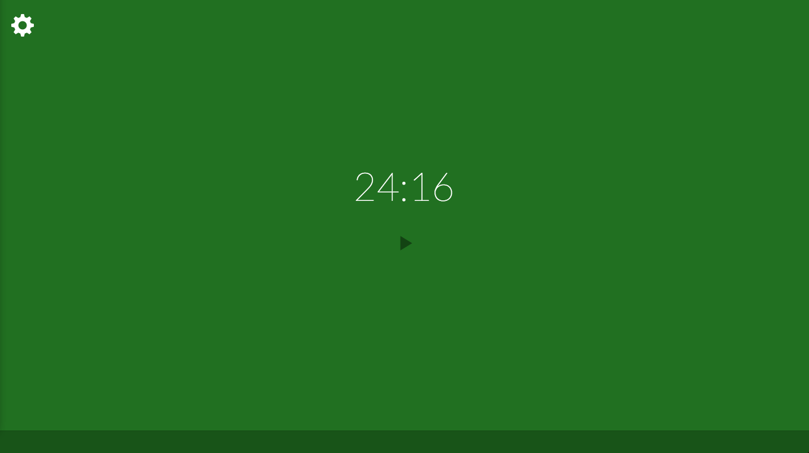

Pomodoro app
================

This repo contains code for my own pomodoro app, which you can run in browser's tab.

Pomodoro time is 25 mints, short break is 5 mints, long break is 25 mints. Maybe someday it will be editable.

When break/work time ends it:
- shows notification popup 
- plays nice sound which you can disable in settings.

Link to working example is available on [github.io](http://norbertes.github.io/pomodoro/), and it looks like this:

Yeah, so AWESOME, but it's workin for me. Just open link, click anywhere for start and work.
